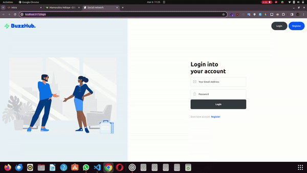

# Social Network

This project is a social network similar to Facebook, featuring functionalities such as profile creation, message posting, private messaging, group management, notifications, and more.

# Features

## Frontend (Svelte & SvelteKit)

- User profile creation
- Message posting
- Private messaging
- Group management
- Real-time notifications
- Dynamic and responsive user interface

## Backend (Go)

- Routing and API management
- User authentication
- Data storage in SQLite database
- Real-time notification management with WebSocket


## Installation and Configuration

1. **Frontend (Svelte & SvelteKit)**:
   - Install dependencies:
     ```bash
     cd frontend
     npm install
     ```

2. **Backend (Go)**:
   - Install dependencies:
     ```bash
     cd backend
     go mod tidy
     ```

3. **SQLite Database**:
   - The SQLite database will be created automatically on the first startup of the backend application.

4. **Environment Variables**:
   - Create a `.env` file to specify necessary environment variables, such as secret keys, database parameters, etc.

## Usage

1. **Frontend (Svelte & SvelteKit)**:
   - Launch the application in development mode:
     ```bash
     cd frontend
     npm run dev
     ```

2. **Backend (Go)**:
   - Launch the backend application:
     ```bash
     cd backend
     go run .
     ```

# Participants

Here is the list of participants along with their Gitea profiles:

1. mamoundiaye - [gitea.com/mamoundiaye](https://learn.zone01dakar.sn/git/mamoundiaye)
2. papgueye - [gitea.com/papgueye](https://learn.zone01dakar.sn/git/papgueye)
3. pndione - [gitea.com/pndione](https://learn.zone01dakar.sn/git/pndione)
4. papaabddiop - [gitea.com/papaabddiop](https://learn.zone01dakar.sn/git/papaabddiop)
5. abdouksow - [gitea.com/abdouksow](https://learn.zone01dakar.sn/git/abdouksow)
